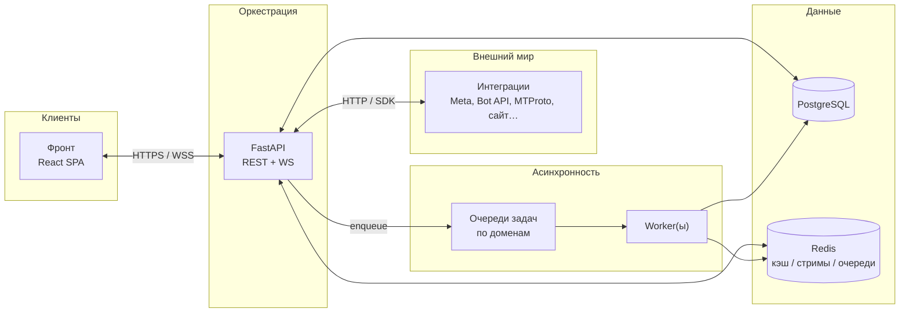
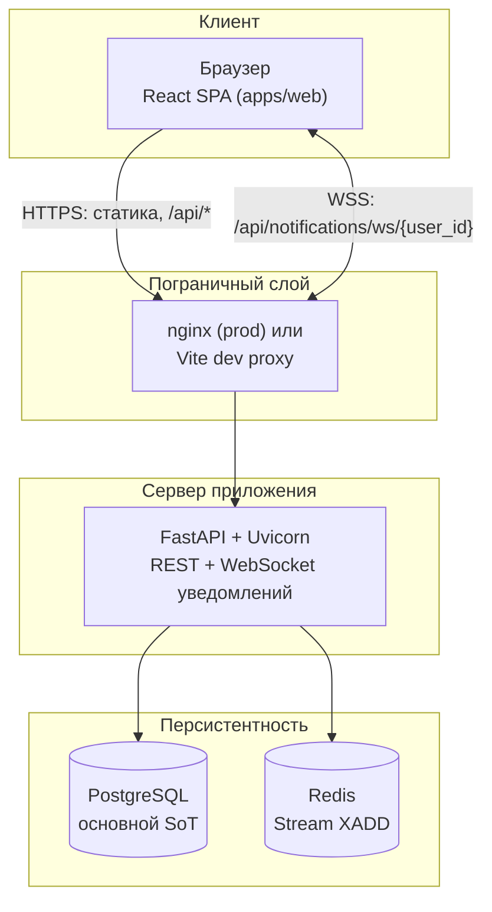
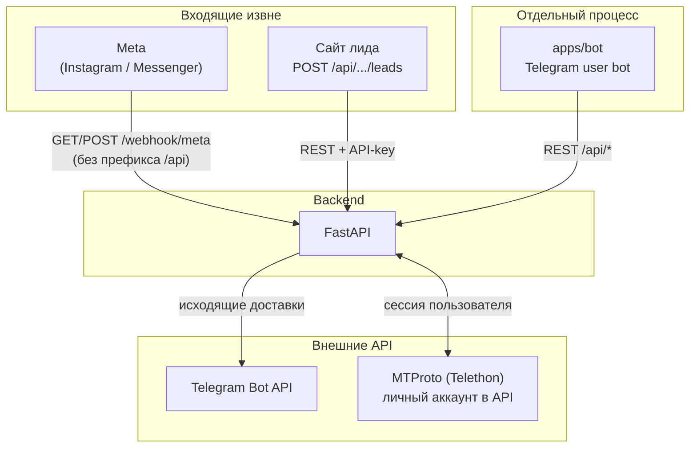

# Системная архитектура

Документ совмещает два уровня:

1. **Техническое задание (ТЗ) на целевую архитектуру** — к чему стремимся при развитии продукта: масштабирование, доменный слой, очереди, устойчивость.
2. **As-built (как в коде сейчас)** — фактическая схема репозитория; источник правды — `apps/api`, `apps/web`, `apps/bot`.

---

# Часть I. ТЗ: целевая архитектура

## I.1. Принципы

| Принцип | Смысл |
| -------- | ------ |
| **FastAPI как оркестратор** | Единая точка для авторизации, RBAC, валидации, оркестрации вызовов к БД, кэшу, очередям и внешним API. Тяжёлая работа — за пределами критического пути HTTP там, где возможно. |
| **Горизонтальное масштабирование** | Экземпляры API и воркеров можно добавлять независимо; Redis и БД — отдельные сервисы. Реплика БД — следующий этап после стабилизации нагрузки. |
| **Домен в центре** | Бизнес-правила и сущности (`Deal`, `Client`, доставка уведомлений, сессия интеграции) описываются явно, а не «размазаны» только по роутерам и SQL. |
| **Управляемые процессы** | Жизненные циклы со «свободным» полем `status` со временем заменяются или дополняются **явными переходами** (конечный автомат), чтобы не ловить недопустимые состояния. |
| **«Что если сломается»** | Ретраи, DLQ, идемпотентность, логи/метрики — часть спецификации, а не догоняющий рефакторинг. |

## I.2. Целевая логическая схема (hub-and-spoke)

Обобщённая модель, согласованная с продуктовой схемой «ядро + спицы»:



**Назначение узлов:**

- **Фронт** — UI; не хранит секреты интеграций; для защищённых бинарников (например медиа из MTProto) запрашивает API с `Authorization: Bearer`.
- **FastAPI** — граница доверия: JWT, **серверный RBAC** (`require_permission`, доменные зависимости вроде доступа к CRM-чатам), маппинг DTO.
- **Внешние интеграции** — вызываются из API и/или из воркеров (тяжёлые или нестабильные сценарии — по ТЗ выносятся из синхронного запроса).
- **PostgreSQL** — источник правды по сущностям; воркеры пишют туда же, что читает API (единая модель данных).
- **Redis** — кэш, стримы событий, **очереди задач** (в целевом виде — несколько логических очередей, см. ниже).
- **Worker + очередь** — фоновая обработка: доставки, синхронизации, тяжёлые интеграции, ретраи без блокировки HTTP.

## I.3. Доменный слой (целевое состояние)

**Проблема middle-подхода:** думать только «роутер → сервис → БД».

**Целевой senior-подход:** выделить **домен** — сущности, инварианты, сценарии (use cases), которые не зависят от FastAPI и транспорта.

| Уровень | Ответственность | Пример в репозитории (направление развития) |
| -------- | ----------------- | --------------------------------------------- |
| **Доставка (transport)** | HTTP, WebSocket, вебхуки | `app/routers/` |
| **Прикладные сценарии** | «Синхронизировать переписку», «Отправить в Instagram» | сервисы или `domain/` use cases |
| **Домен** | Правила сделки, комментария, прав доступа к операции | рядом с моделями или отдельный пакет |
| **Инфраструктура** | SQLAlchemy, Redis, HTTP-клиенты к Meta/Telegram | `services/`, адаптеры |

Критерий готовности: новый сценарий можно протестировать без поднятия HTTP-сервера (юнит-тесты домена и use case).

## I.4. Очереди задач (целевое состояние)

**Антипаттерн:** одна «общая каша» из всех типов задач.

**Целевое разбиение** (логические имена; физически — разные ключи Redis / разные streams / разные Celery queues — на выбор стека):

```yaml
queues:
  - tasks          # фоновые задачи продукта (отчёты, массовые операции)
  - notifications  # доставка уведомлений (Telegram, e-mail, push)
  - payments       # платежи и биллинг (если/когда появятся)
  - integrations   # Meta, MTProto, сайт: синк, вебхуки, ретраи
```

Плюсы: независимое масштабирование воркеров, мониторинг очередей по домену, изоляция сбоев (падение интеграций не блокирует уведомления и наоборот).

## I.5. Конечные автоматы (целевое состояние)

Вместо одного строкового «статуса без правил» — **явные состояния и переходы** для долгоживущих процессов.

**Примеры доменов:**

| Объект | Зачем |
| -------- | ------ |
| Подписка / оплата | `pending → active → cancelled` / `failed` |
| Сессия личного Telegram (MTProto) | `inactive → pending_code → pending_password → active` (запрет недопустимых переходов в одном месте) |
| Доставка уведомления | `pending → sending → sent` / `failed` + политика ретраев и DLQ |

Формулировка ТЗ: *не просто поле «статус», а управляемый процесс с документированными переходами и обработкой ошибок.*

## I.6. Нефункциональные требования (чеклист «production-grade»)

Минимальный набор, который должен закрываться по мере роста нагрузки и команды:

| Тема | Требование |
| ------ | ------------ |
| **Наблюдаемость** | Структурированные логи, корреляция `request_id`, метрики (латентность, ошибки, глубина очередей), алерты по SLO. |
| **Устойчивость** | Ретраи с backoff для внешних API; **DLQ** или аналог для сообщений, исчерпавших попытки. |
| **Безопасность** | Серверная проверка прав на каждый критичный эндпоинт; секреты только на сервере; принцип наименьших привилегий для токенов интеграций. |
| **Слой сервисов** | Роутеры тонкие; повторяющаяся логика — в сервисах / домене. |
| **Идемпотентность** | Повтор запроса (сетевой ретрай, дубль вебхука) не создаёт дубликатов сущностей — ключи идемпотентности, дедуп по внешним id. |
| **Версионирование API** | При ломающих изменениях — префикс версии или согласованный deprecation; OpenAPI как контракт. |
| **Масштабирование** | Stateless API за балансировщиком; учёт sticky-сессий только там, где неизбежно (см. ограничения WebSocket ниже). |

## I.7. Безопасность и RBAC (обязательное на сервере)

- Критичные операции (отправка в мессенджеры, синхронизация переписки, выдача медиа по сделке) **не опираются только на UI**: проверки прав в зависимостях FastAPI и в сервисном слое.
- Роли и права хранятся в БД; согласованность с фронтом — через единый каталог ключей прав (`permissions`).

---

# Часть II. Текущая реализация (as-built)

## II.1. Монорепозиторий


| Путь       | Назначение                                                                               |
| ---------- | ---------------------------------------------------------------------------------------- |
| `apps/web` | Клиент: Vite, React 19, TypeScript, Tailwind. Статический билд, в проде раздаётся nginx. |
| `apps/api` | Сервер: FastAPI, SQLAlchemy 2 async, Alembic, Uvicorn.                                   |
| `apps/bot` | Отдельный процесс: `python-telegram-bot`, HTTP-клиент к API (не встроен в uvicorn).      |
| `ops/`     | nginx, скрипты деплоя.                                                                   |


Связь **браузер ↔ API** — по HTTPS и WebSocket через один прокси. Связь **бот ↔ API** — отдельный процесс → HTTP на тот же backend. Это **разные роли** (интерактивный пользователь vs. фоновый сервис), поэтому на схемах они вынесены в разные блоки.

---

## II.2. Схема A — основной поток данных (вертикально)



**Пояснения:**

- **Один процесс** FastAPI обслуживает и REST, и WebSocket для колокольчика (in-memory hub внутри процесса).
- **Redis** — запись доменных событий в Stream; **отдельного consumer’а по стриму в репозитории нет** (см. II.7).
- **Фоновые циклы** (доставка уведомлений, polling Telegram-лидов и т.д.) сейчас крутятся **внутри процесса API** (`lifespan`), а не в отдельном воркере — это расхождение с целевой схемой I.2 / I.4.

---

## II.3. Схема B — внешние входы и бот



**Важно:**

- В **том же** процессе FastAPI выполняется **polling** входящих лидов Telegram (`getUpdates` по токенам воронок) — это **не** `apps/bot`.
- **Личный Telegram (MTProto)** — Telethon в `apps/api`, сессии в БД; синхрон сообщений и выдача медиа идут **синхронно в HTTP-запросе** (до введения очереди `integrations` из ТЗ).

---

## II.4. Сводная таблица компонентов


| Компонент      | Технологии                                 | Назначение                                                                                                   |
| -------------- | ------------------------------------------ | ------------------------------------------------------------------------------------------------------------ |
| **Frontend**   | Vite, React 19, TypeScript, Tailwind       | SPA; запросы к `/api/*` (прокси Vite в dev, nginx в prod).                                                   |
| **Backend**    | FastAPI, SQLAlchemy async, Alembic         | REST, вебхуки, фоновые циклы в `lifespan`, WebSocket уведомлений.                                            |
| **PostgreSQL** | Единственный SoT по сущностям              | Задачи, сделки, клиенты, сообщения, уведомления, пользователи, интеграции, сессии MTProto и т.д.              |
| **Redis**      | `XADD` в stream (`events.domain.v1` и др.) | Журнал доменных событий; инициализация stream/group при старте. **Consumer по стриму в репозитории не реализован.** |
| **apps/bot**   | Отдельный Python-процесс                   | Опрос/вызов API, зеркалирование веб-чата в Telegram, рассылки по расписанию — см. `apps/bot/`.               |


---

## II.5. Жизненный цикл процесса API (`lifespan`)

При старте Uvicorn (`apps/api/app/main.py`):

1. **Alembic** `upgrade head` — миграции БД.
2. **`ensure_redis_stream_and_group`** — подготовка Redis Stream (ошибки логируются, старт не падает).
3. Фоновые **asyncio**-задачи (пока живёт процесс):
  - **Доставка уведомлений** — `run_pending_deliveries` каждые **~5 с** (Telegram, e-mail и т.д. из `notification_deliveries`).
  - **Retention** — очистка старых уведомлений с интервалом из настроек (не реже ~60 с).
  - **Telegram-leads** — `poll_all_funnels` (интервал из `TELEGRAM_LEADS_POLL_INTERVAL_SECONDS`).

Остановка — корректная отмена задач при shutdown.

*С точки зрения ТЗ (I.4): это «встроенный воркер» внутри API; целевой вариант — вынести в отдельные процессы и очереди.*

---

## II.6. Типовый HTTP-запрос от браузера

1. Пользователь действует в UI → `fetch` на `/api/...` с `Authorization: Bearer` (если залогинен).
2. Роутер FastAPI → сервисный слой → SQLAlchemy → Postgres.
3. При доменно значимом изменении — `emit_domain_event` / `log_entity_mutation` → `notification_events` + при необходимости Redis `XADD` + `process_domain_event` → записи `notifications` / `notification_deliveries` / зеркало в inbox.
4. Ответ JSON клиенту; при создании уведомления — дополнительно **push по WebSocket** подписчикам пользователя.

---

## II.7. Доменные события и уведомления (детальнее)

1. Роутеры вызывают `emit_domain_event` / `log_entity_mutation` (`apps/api/app/services/domain_events.py`).
2. Событие пишется в таблицу `notification_events` (Postgres).
3. Параллельно `publish_domain_event` → Redis Stream (`REDIS_EVENTS_STREAM`, по умолчанию `events.domain.v1`) через `XADD` с ограничением длины. Если Redis недоступен, публикация падает, но запись в БД уже есть (флаги `published_to_stream`, `stream_id`).
4. В том же запросе вызывается `process_domain_event` (`notification_hub.py`): по типу события строятся получатели, создаются `notifications` и `notification_deliveries`, при включённых каналах — зеркало во **внутренний чат** (`inbox_messages`).

**Важно:** обработка **синхронная в рамках HTTP-запроса**, не через отдельный воркер, читающий Redis. Стрим — **аудит/буфер/мониторинг** и задел под внешних подписчиков, но **не** полноценная очередь с `XREADGROUP` в этом репозитории.

---

## II.8. «Мгновенность» в интерфейсе


| Канал                        | Механизм                                                                   | Задержка / ограничения                                                                                                                                                                                                                                |
| ---------------------------- | -------------------------------------------------------------------------- | ----------------------------------------------------------------------------------------------------------------------------------------------------------------------------------------------------------------------------------------------------- |
| **In-app уведомления**       | `realtime_hub.emit` → WebSocket `GET /api/notifications/ws/{user_id}`      | Пока клиент онлайн — быстро. **Нет общей шины между несколькими инстансами API** — при масштабировании пользователь должен попасть на тот же процесс, где открыт сокет. При ошибке подключения фронт может отключить WS на сессию (`sessionStorage`). |
| **Nginx**                    | Нужен `Upgrade` для WebSocket                                              | Иначе WS падает.                                                                                                                                                                                                                                               |
| **Внутренний чат**           | `GET /messages` polling **~5 с**                                           | Опрос, не push.                                                                                                                                                                                                                                       |
| **Telegram исходящие**       | Очередь `notification_deliveries`, цикл каждые ~5 с                        | Не realtime.                                                                                                                                                                                                                                          |
| **Telegram лиды (входящие)** | Server-side `getUpdates`, offset в Postgres (`telegram_integration_state`) | Задержка = интервал polling (секунды).                                                                                                                                                                                                                |


**Итог:** «мгновенно» в первую очередь для **колокольчика через WebSocket** при корректном прокси. Чат сотрудников и Telegram-зеркала **не** рассчитаны на миллисекундную доставку.

---

## II.9. Интеграции (границы системы)


| Источник                       | Протокол                                                    | Назначение                                          |
| ------------------------------ | ----------------------------------------------------------- | --------------------------------------------------- |
| **Meta**                       | `POST /webhook/meta` (без `/api`, см. `main.py`)            | Входящие Instagram/Messenger; верификация `GET`.    |
| **Сайт**                       | `POST /api/integrations/site/leads` + заголовок `X-Api-Key` | Лиды с форм; ключ в настройках воронки.             |
| **Telegram (исходящие лидам)** | Backend → Telegram Bot API                                  | Отправка из `notification_deliveries` / интеграций. |
| **Telegram (входящие лиды)**   | Polling в процессе FastAPI                                  | Не путать с `apps/bot`.                             |
| **Telegram (личный MTProto)**  | Telethon в API, сессия в БД                                 | Синхрон переписки в комментарии сделки, отправка от пользователя, выдача медиа по `message_id`. |

Исходящие в Meta — Graph API, переменные `META_*` в `config.py`.

---

## II.10. База данных

- Схема: `apps/api/app/models/`, миграции Alembic.
- Сводка полей таблиц: [ENTITIES.md](./ENTITIES.md) (генерация из моделей).
- Сделки (`deals`): маппинг полей camelCase на границе API; расхождения UI/данных — зона отладки форм.

---

## II.11. Соответствие ТЗ: дорожная карта (кратко)

| Тема ТЗ (часть I) | Сейчас (часть II) | Направление работ |
| ------------------ | ------------------ | ------------------- |
| Отдельные очереди | Один стрим + циклы в `lifespan` | Ввести именованные очереди; вынести доставки и интеграции в воркеры. |
| Доменный слой | Логика в `routers/` и `services/` | Выделить use cases и инварианты; тесты без HTTP. |
| State machine | Строковые статусы (сессии, доставки) | Документировать переходы; при необходимости — таблица/код автомата. |
| Идемпотентность | Частично (вебхуки Meta и др.) | Расширить ключами на все критичные внешние события. |
| WebSocket при N инстансах | In-memory hub | Redis pub/sub или аналог для `emit`. |

---

## II.12. Известные архитектурные ограничения

- Внутренний чат — polling, не WebSocket push.
- Redis Stream не используется как очередь с подписчиками в коде — только запись.
- WebSocket-уведомления привязаны к одному процессу API.
- Тяжёлые вызовы MTProto выполняются в запросе API — риск таймаутов при больших медиа; целевое решение — очередь `integrations` и кэш/хранилище файлов.
- Отдельные продуктовые несогласованности UI — через задачи в трекере, не «одна строка в архитектуре».

---

## II.13. Связанные документы

- [API.md](./API.md) — HTTP-модули и точки интеграции.
- [FRONTEND.md](./FRONTEND.md) — клиент и экраны.
- [OPERATIONS.md](./OPERATIONS.md) — деплой и окружение.
- [ENTITIES.md](./ENTITIES.md) — таблицы и поля БД (генерация из моделей).
