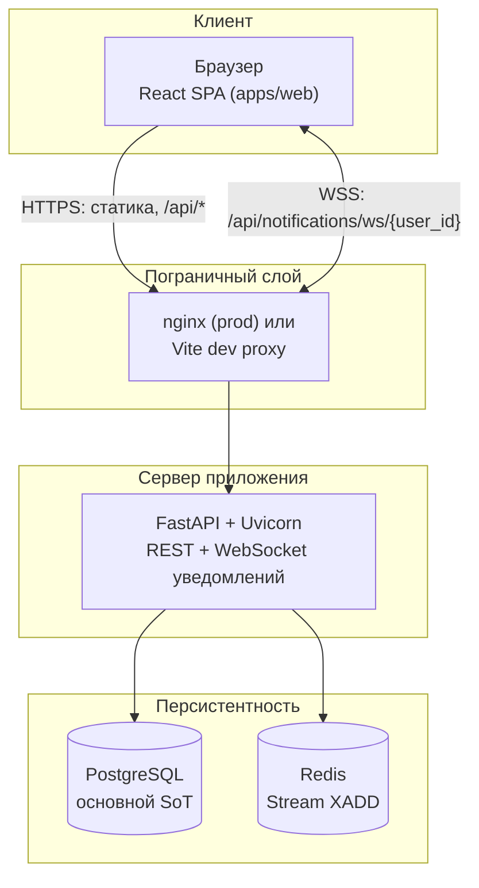
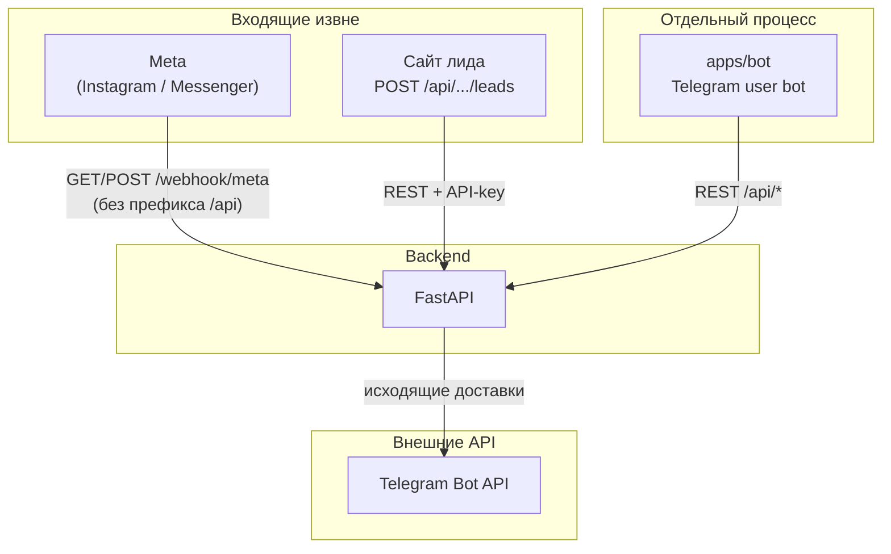

# Системная архитектура

Документ описывает **как устроено в коде сейчас**. Источник правды — репозиторий (`apps/api`, `apps/web`, `apps/bot`).

## 1. Монорепозиторий

| Путь       | Назначение                                                                               |
| ---------- | ---------------------------------------------------------------------------------------- |
| `apps/web` | Клиент: Vite, React 19, TypeScript, Tailwind. Статический билд, в проде раздаётся nginx. |
| `apps/api` | Сервер: FastAPI, SQLAlchemy 2 async, Alembic, Uvicorn.                                   |
| `apps/bot` | Отдельный процесс: `python-telegram-bot`, HTTP-клиент к API (не встроен в uvicorn).      |
| `ops/`     | nginx, скрипты деплоя.                                                                   |

Связь **браузер ↔ API** — по HTTPS и WebSocket через один прокси. Связь **бот ↔ API** — отдельный процесс → HTTP на тот же backend. Это **разные роли** (интерактивный пользователь vs. фоновый сервис), поэтому на схемах они вынесены в разные блоки — без наложения «бот на клиент».

---

## 2. Схема A — основной поток данных (вертикально)

Схема **сверху вниз** (`flowchart TB`), чтобы рендереры Mermaid и GitHub не сжимали узлы в одну линию.

**Пояснения:**

- **Один процесс** FastAPI обслуживает и REST, и WebSocket для колокольчика (in-memory hub внутри процесса).
- **Redis** — запись доменных событий в Stream; отдельного consumer’а в репозитории нет (см. ниже).

---

## 3. Схема B — внешние входы и бот (без пересечения с браузером)

**Важно:** внутри **того же** процесса FastAPI крутится **polling** входящих лидов Telegram (`getUpdates` по токенам воронок) — это **не** `apps/bot`. Бот в `apps/bot` — другой сценарий (зеркалирование, рассылки и т.д.).

---

## 4. Сводная таблица компонентов

| Компонент      | Технологии                                 | Назначение                                                                                                   |
| -------------- | ------------------------------------------ | ------------------------------------------------------------------------------------------------------------ |
| **Frontend**   | Vite, React 19, TypeScript, Tailwind       | SPA; запросы к `/api/*` (прокси Vite в dev, nginx в prod).                                                   |
| **Backend**    | FastAPI, SQLAlchemy async, Alembic         | REST, вебхуки, фоновые циклы в `lifespan`, WebSocket уведомлений.                                            |
| **PostgreSQL** | Единственный SoT по сущностям              | Задачи, сделки, клиенты, сообщения, уведомления, пользователи, состояние Telegram-интеграций и т.д.          |
| **Redis**      | `XADD` в stream (`events.domain.v1` и др.) | Журнал доменных событий; инициализация stream/group при старте. **Отдельного consumer’а в репозитории нет**. |
| **apps/bot**   | Отдельный Python-процесс                   | Опрос/вызов API, зеркалирование веб-чата в Telegram, рассылки по расписанию — см. `apps/bot/`.               |

---

## 5. Жизненный цикл процесса API (`lifespan`)

При старте Uvicorn (`apps/api/app/main.py`):

1. **Alembic** `upgrade head` — миграции БД.
2. `**ensure_redis_stream_and_group`** — подготовка Redis Stream (ошибки логируются, старт не падает).
3. Фоновые **asyncio**-задачи (пока живёт процесс):
  - **Доставка уведомлений** — `run_pending_deliveries` каждые **~5 с** (Telegram, e-mail и т.д. из `notification_deliveries`).
  - **Retention** — очистка старых уведомлений с интервалом из настроек (не реже ~60 с).
  - **Telegram-leads** — `poll_all_funnels` (интервал из `TELEGRAM_LEADS_POLL_INTERVAL_SECONDS`, по умолчанию порядка секунд).

Остановка — корректная отмена задач при shutdown.

---

## 6. Типовый HTTP-запрос от браузера

1. Пользователь действует в UI → `fetch` на `/api/...` с `Authorization: Bearer` (если залогинен).
2. Роутер FastAPI → сервисный слой → SQLAlchemy → Postgres.
3. При доменно значимом изменении — `emit_domain_event` / `log_entity_mutation` → `notification_events` + при необходимости Redis `XADD` + `process_domain_event` → записи `notifications` / `notification_deliveries` / зеркало в inbox.
4. Ответ JSON клиенту; при создании уведомления — дополнительно **push по WebSocket** подписчикам пользователя.

---

## 7. Доменные события и уведомления (детальнее)

1. Роутеры вызывают `emit_domain_event` / `log_entity_mutation` (`apps/api/app/services/domain_events.py`).
2. Событие пишется в таблицу `notification_events` (Postgres).
3. Параллельно `publish_domain_event` → Redis Stream (`REDIS_EVENTS_STREAM`, по умолчанию `events.domain.v1`) через `XADD` с ограничением длины. Если Redis недоступен, публикация падает, но запись в БД уже есть (флаги `published_to_stream`, `stream_id`).
4. В том же запросе вызывается `process_domain_event` (`notification_hub.py`): по типу события строятся получатели, создаются `notifications` и `notification_deliveries`, при включённых каналах — зеркало во **внутренний чат** (`inbox_messages`).

**Важно:** обработка **синхронная в рамках HTTP-запроса**, не через отдельный воркер, читающий Redis. Стрим — **аудит/буфер/мониторинг**, не очередь с `XREADGROUP` в этом репозитории.

---

## 8. «Мгновенность» в интерфейсе

| Канал                        | Механизм                                                                   | Задержка / ограничения                                                                                                                                                                                                                                |
| ---------------------------- | -------------------------------------------------------------------------- | ----------------------------------------------------------------------------------------------------------------------------------------------------------------------------------------------------------------------------------------------------- |
| **In-app уведомления**       | `realtime_hub.emit` → WebSocket `GET /api/notifications/ws/{user_id}`      | Пока клиент онлайн — быстро. **Нет общей шины между несколькими инстансами API** — при масштабировании пользователь должен попасть на тот же процесс, где открыт сокет. При ошибке подключения фронт может отключить WS на сессию (`sessionStorage`). |
| **Nginx**                    | Нужен `Upgrade` для WebSocket                                              | Иначе WS падает; фронт может отключить WS на сессию (`sessionStorage`).                                                                                                                                                                               |
| **Внутренний чат**           | `GET /messages` polling **~5 с**                                           | Опрос, не push.                                                                                                                                                                                                                                       |
| **Telegram исходящие**       | Очередь `notification_deliveries`, цикл каждые ~5 с                        | Не realtime.                                                                                                                                                                                                                                          |
| **Telegram лиды (входящие)** | Server-side `getUpdates`, offset в Postgres (`telegram_integration_state`) | Задержка = интервал polling (секунды).                                                                                                                                                                                                                |

**Итог:** «мгновенно» в первую очередь для **колокольчика через WebSocket** при корректном прокси. Чат сотрудников и Telegram-зеркала **не** рассчитаны на миллисекундную доставку.

---

## 9. Интеграции (границы системы)

| Источник                       | Протокол                                                    | Назначение                                          |
| ------------------------------ | ----------------------------------------------------------- | --------------------------------------------------- |
| **Meta**                       | `POST /webhook/meta` (без `/api`, см. `main.py`)            | Входящие Instagram/Messenger; верификация `GET`.    |
| **Сайт**                       | `POST /api/integrations/site/leads` + заголовок `X-Api-Key` | Лиды с форм; ключ в настройках воронки.             |
| **Telegram (исходящие лидам)** | Backend → Telegram Bot API                                  | Отправка из `notification_deliveries` / интеграций. |
| **Telegram (входящие лиды)**   | Polling в процессе FastAPI                                  | Не путать с `apps/bot`.                             |

Исходящие в Meta — Graph API, переменные `META_`* в `config.py`.

---

## 10. База данных

- Схема: `apps/api/app/models/`, миграции Alembic.
- Сделки (`deals`): маппинг полей camelCase на границе API; расхождения UI/данных — зона отладки форм.

---

## 11. Известные архитектурные ограничения

- Внутренний чат — polling, не WebSocket push.
- Redis Stream не используется как очередь с подписчиками в коде — только запись.
- WebSocket-уведомления привязаны к одному процессу API.
- Отдельные продуктовые несогласованности UI — через задачи в трекере, не «одна строка в архитектуре».

---

## 12. Связанные документы

- [API.md](./API.md) — HTTP-модули и точки интеграции.
- [FRONTEND.md](./FRONTEND.md) — клиент и экраны.
- [OPERATIONS.md](./OPERATIONS.md) — деплой и окружение.

